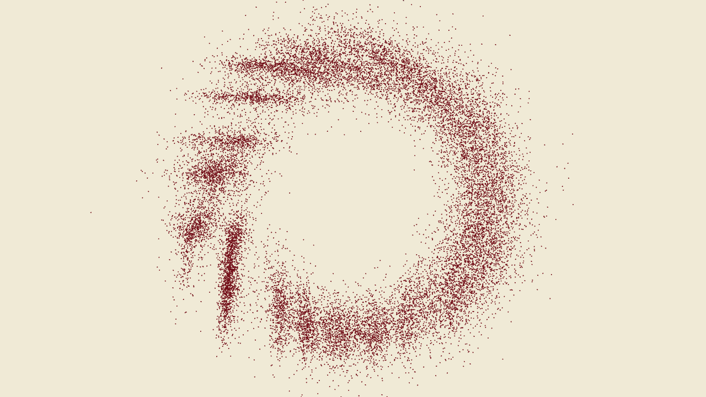
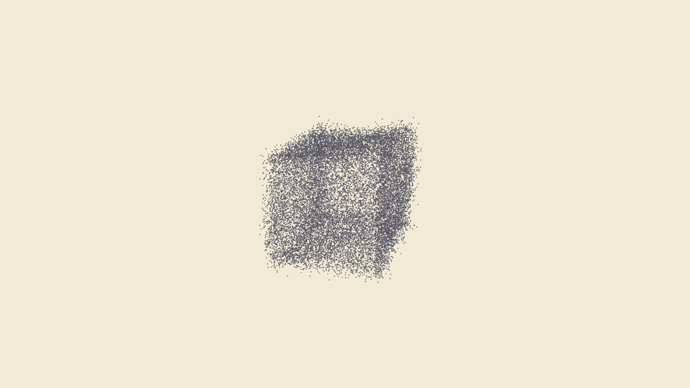
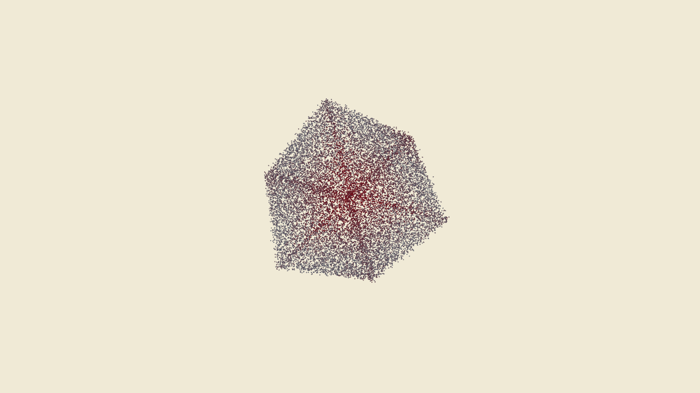

# HandParticles

Particle system that responds to hand gestures. Uses your webcam to detect fist, open hand, and thumbs up, and makes 20k particles do different things. Particles show tension through color—more movement adds red to the navy ink.

## What it does

Three gestures control the particles:

- **Fist** → particles spin around the center and get chaotic
- **Open hand** → everything calms down and slows
- **Thumbs up** → particles form a rotating 3D cube

No gesture = normal drifting behavior. The tension in the system is visible—calm particles stay dark navy, while high-tension (fast-moving) particles shift toward red.

## Screenshots


*Particles in normal drift mode*


*Fist gesture - chaotic spin mode*


*Thumbs up gesture - 3D cube formation*

## Controls

```
TAB     Toggle GUI on/off
s       Save screenshot
g       Switch between gesture and keyboard control
b       Capture background (move hand away first)
c       Show/hide webcam feed
d       Show/hide debug info
1-4     Manually trigger gestures
```

## Building

Needs openFrameworks 0.12.1+ with ofxOpenCV and ofxGui.

```bash
make
make RunRelease
```

## Setup notes

The gesture detection works best with:
- Decent lighting (hand needs contrast with background)
- Hand about 1-2 feet from camera
- If background is messy, press `b` with your hand out of frame, then toggle "Use Background Sub" in the GUI

Adjust "Gesture Threshold" slider if your hand isn't being detected. You'll see the processed image in the top-left when the webcam view is on.

## How the CV works

Pretty straightforward pipeline:
1. Blur the image to kill noise
2. Threshold to get hand silhouette
3. Find contours, pick the biggest one
4. Calculate convex hull and count the gaps (convexity defects)
5. Gaps = fingers spread, no gaps = fist, one gap + tall shape = thumbs up
6. Average the last 5 frames to avoid flickering

The GUI lets you tweak blur amount, threshold, min/max hand size, and all the particle behavior params.

## Visual style

Navy ink on eggshell white—wanted it to feel like ink on paper instead of the usual neon-on-black look. The red hue represents tension in the system. Low-tension particles drift slowly and stay dark navy. High-tension (rapid movement) particles bleed red, showing where the energy is.

## License

MIT - do whatever
